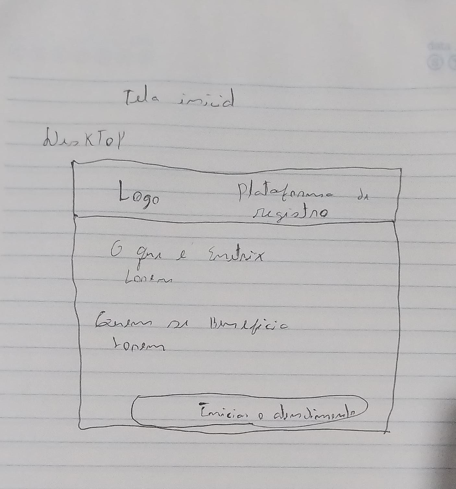
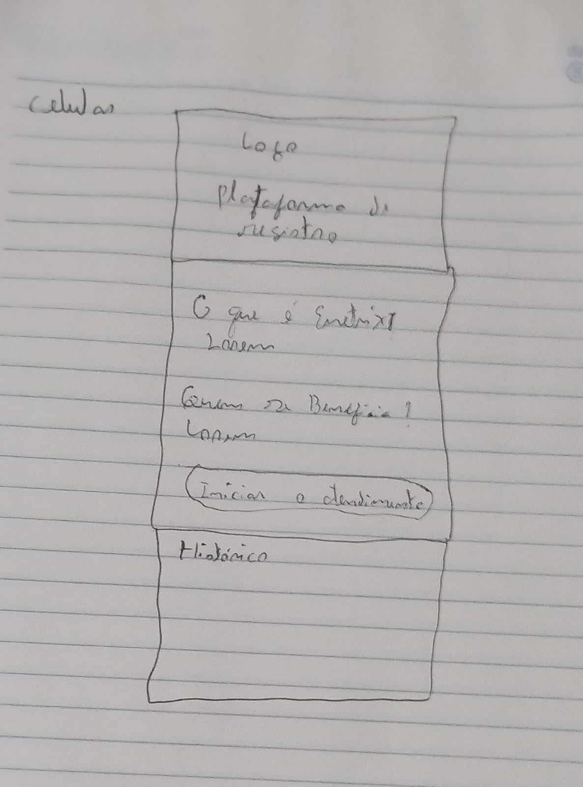
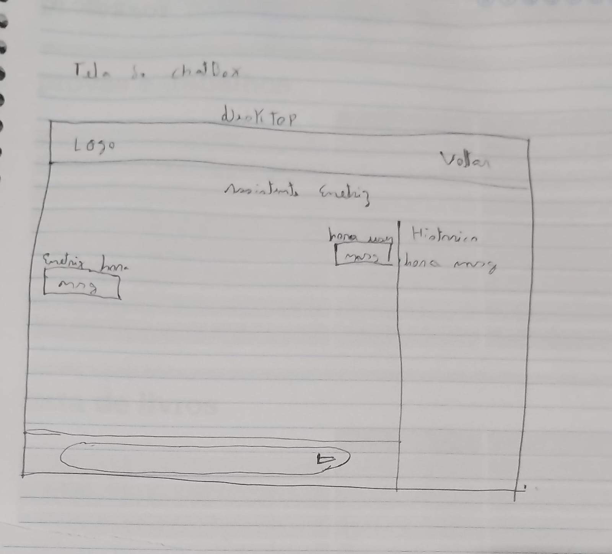
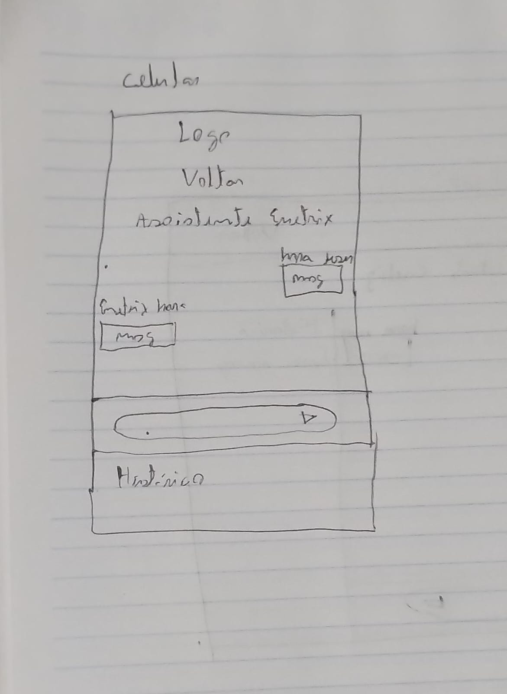

# ENETRIX Chatbot — Desafio Técnico Frontend

Painel de atendimento simulando integração com um chatbot, desenvolvido como parte do processo seletivo para Desenvolvedor(a) Frontend da ENETRIX.

## Tecnologias utilizadas

- **React 19** + **Vite** — biblioteca e bundler do frontend.
- **Tailwind CSS 4** — estilização.
- **JSON Server** — API mock local, simulando o backend/webhook do chatbot.

## Protótipo
 
Antes da implementação, foram desenhados wireframes das telas principais, com apoio do ChatGPT para refinar a imagem a partir do desenho original.
 
| Tela inicial (desktop) | Tela inicial (mobile) |
|---|---|
|  |  |
 
| Chat (desktop) | Chat (mobile) |
|---|---|
|  |  |


## Como instalar e executar

Pré-requisitos: Node.js instalado.

```bash
# instalar dependências
npm install

# rodar o frontend (Vite)
npm run dev

# em outro terminal, rodar o servidor mock (json-server)
node server/server.js
```

- Frontend: http://localhost:3000
- API mock: http://localhost:3001

> Os dois processos precisam rodar ao mesmo tempo, em terminais separados.


## Ferramentas de inteligência artificial utilizadas
 
- **ChatGPT**: usado como apoio para melhorar/refinar a imagem do protótipo que desenhei manualmente antes da implementação.
- **Claude (Anthropic)**: utilizado durante o desenvolvimento do código, para:
  - Diagnosticar e corrigir o problema de reload da página causado pelo Vite observando mudanças no `db.json`.
  - Ajustar o caminho de leitura/escrita do `db.json` no `server.js`.
  - Implementar API JSON-SERVER
  - Implementar a funcionalidade de persistência do histórico ao recarregar a tela.
  - Na criação das telas no react
